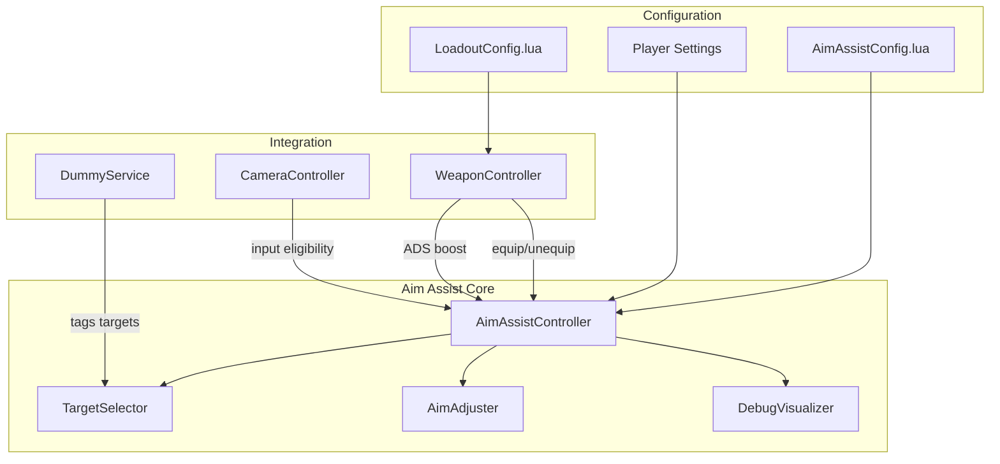

# Aim Assist System

Comprehensive aim assist system supporting gamepad, touch, and mouse input with per-weapon configuration and player preference settings.

## Overview

The Aim Assist system helps players aim at targets using three complementary methods:

- **Friction**: Slows down camera movement when near a target
- **Tracking**: Follows moving targets to maintain relative position
- **Centering**: Gently pulls aim toward the target center

## Architecture



## File Structure

```
src/ReplicatedStorage/Game/AimAssist/
├── init.lua              → Main controller
├── AimAssistConfig.lua   → Global configuration
├── AimAssistEnum.lua     → Type definitions
├── TargetSelector.lua    → Target acquisition
├── AimAdjuster.lua       → Aim modification
└── DebugVisualizer.lua   → Debug visualization
```

## Aim Assist Methods

### ADS Snap (Fortnite-Style)

Instantly snaps the camera toward the nearest valid target when aiming down sights. This provides immediate target acquisition similar to Fortnite's aim assist.

| Setting | Description | Typical Range |
|---------|-------------|---------------|
| enabled | Enable/disable snap | true/false |
| strength | How much to rotate toward target (0-1) | 0.4 - 0.6 |
| maxAngle | Max degrees to snap | 10° - 20° |

**When it helps**: Quick target acquisition when entering ADS

### Friction (Slowdown)

Reduces camera movement sensitivity when crosshair is near a target.

| Setting | Description | Typical Range |
|---------|-------------|---------------|
| Strength | How much to slow movement | 0.2 - 0.4 |

**When it helps**: Prevents overshooting targets when tracking

### Tracking (Sticky Aim)

Compensates for target movement to keep them in the same relative position.

| Setting | Description | Typical Range |
|---------|-------------|---------------|
| Strength | How strongly to follow | 0.3 - 0.5 |

**When it helps**: Maintains aim on moving targets without manual adjustment

### Centering (Magnetism)

Gently pulls the crosshair toward the target center using smooth interpolation.

| Setting | Description | Typical Range |
|---------|-------------|---------------|
| Strength | Pull strength | 0.05 - 0.2 |

**When it helps**: Fine-tunes aim when already near a target

---

## Configuration

### Per-Weapon Settings (LoadoutConfig.lua)

Each weapon can have custom aim assist settings:

```lua
AssaultRifle = {
    -- ... other weapon config ...
    
    aimAssist = {
        enabled = true,
        range = 200,           -- Max targeting distance (studs)
        minRange = 5,          -- No assist closer than this
        fov = 25,              -- Cone angle (degrees)
        sortingBehavior = "angle",  -- "angle" or "distance"
        friction = 0.25,       -- Slowdown strength
        tracking = 0.35,       -- Follow strength
        centering = 0.1,       -- Pull strength
        adsBoost = {           -- Multipliers when ADS
            Friction = 1.4,
            Tracking = 1.3,
            Centering = 1.2,
        },
        adsSnap = {            -- Fortnite-style snap on ADS
            enabled = true,
            strength = 0.45,   -- How much to snap (0-1)
            maxAngle = 15,     -- Max degrees to snap
        },
    },
}
```

### Weapon Type Presets

| Weapon Type | Range | FOV | Friction | Tracking | Centering | ADS Snap | Notes |
|-------------|-------|-----|----------|----------|-----------|----------|-------|
| **Sniper** | 500 | 20° | 0.4 | 0.5 | 0.3 | 0.6 @ 12° | Strong snap, narrow angle |
| **Assault Rifle** | 200 | 35° | 0.5 | 0.5 | 0.4 | 0.45 @ 15° | Balanced snap |
| **Shotgun** | 100 | 45° | 0.6 | 0.6 | 0.5 | 0.5 @ 20° | Wide snap angle |
| **Revolver** | 150 | 25° | 0.45 | 0.5 | 0.35 | 0.5 @ 12° | Precise snap |
| **Melee** | 15-25 | 55-60° | 0.3-0.4 | 0.4-0.5 | 0.2-0.3 | Disabled | No ADS snap |

### Global Settings (AimAssistConfig.lua)

```lua
AimAssistConfig.Enabled = true           -- Global toggle
AimAssistConfig.Debug = false            -- Show debug visualization
AimAssistConfig.AllowMouseInput = true   -- For testing (set false in production)

AimAssistConfig.Input = {
    GamepadDeadzone = 0.1,               -- Stick deadzone
    TouchInactivityTimeout = 0.5,        -- Seconds
}

AimAssistConfig.TargetTags = {
    Primary = "AimAssistTarget",         -- Tag for targetable objects
}
```

### Player Settings

Players can adjust their aim assist preferences via attributes on `LocalPlayer`:

| Attribute | Type | Default | Description |
|-----------|------|---------|-------------|
| `AimAssistStrength` | number | 1.0 | Overall multiplier (0-1) |
| `AimAssistFriction` | boolean | true | Enable friction |
| `AimAssistTracking` | boolean | true | Enable tracking |
| `AimAssistCentering` | boolean | true | Enable centering |

```lua
-- Example: Player settings UI
LocalPlayer:SetAttribute("AimAssistStrength", 0.8)  -- 80% strength
```

---

## Input Eligibility

Aim assist only activates for appropriate input types:

| Input Type | Eligibility Condition |
|------------|----------------------|
| **Gamepad** | Right stick magnitude > deadzone (0.1) |
| **Touch** | Touch activity within last 0.5 seconds |
| **Mouse** | Only if `AllowMouseInput = true` (testing) |

Additionally, aim assist requires:
- **Cursor locked** (`MouseBehavior == LockCenter`)
- Indicates combat/aiming mode (FirstPerson or Shoulder camera)

---

## Target Selection

### Valid Targets

1. **Players** (excluding local player and teammates)
2. **Tagged Objects** (CollectionService tag: `AimAssistTarget`)

### Target Bones

For better precision, aim assist can target specific bones:

| Tag | Priority | Typical Part |
|-----|----------|--------------|
| `Head` | Highest | Head/face |
| `UpperTorso` | Medium | Chest area |
| `Torso` | Lower | Body center |

### Selection Algorithm

```
1. Gather all targets (players + tagged objects)
2. For each target → get bone positions
3. For each bone:
   ├── Check distance ≤ range
   ├── Check distance ≥ minRange (no point-blank assist)
   ├── Check angle ≤ FOV/2
   ├── Check line-of-sight (raycast)
   └── Score by sortingBehavior
4. Return best target with weighted bones
```

---

## Easing Functions

Easing functions modify aim assist strength based on target attributes:

### Distance Easing

Disables aim assist at very close range:

```lua
function(distance: number): number
    if distance < minRange then
        return 0  -- No assist at point-blank
    end
    return 1
end
```

### Angle Easing

Reduces strength at edge of FOV cone for smoother feel:

```lua
function(normalizedAngle: number): number
    -- normalizedAngle: 0 = center, 1 = edge of FOV
    return 1 - (normalizedAngle * 0.5)  -- 100% at center, 50% at edge
end
```

---

## Integration

### WeaponController Integration

The WeaponController automatically manages aim assist:

```lua
-- Equip weapon → Enable aim assist with weapon config
function WeaponController:_equipWeapon(weaponId, slot)
    -- ... weapon setup ...
    self:_setupAimAssistForWeapon(weaponConfig)
end

-- Unequip weapon → Disable aim assist
function WeaponController:_unequipCurrentWeapon()
    -- ... cleanup ...
    if self._aimAssist then
        self._aimAssist:disable()
    end
end

-- ADS → Apply boost multipliers
function WeaponController:Special(isPressed)
    -- ... ADS logic ...
    self:_updateAimAssistADS(isPressed)
end
```

### CameraController Integration

CameraController feeds input state to aim assist:

```lua
-- Gamepad input
if inputObject.KeyCode == Enum.KeyCode.Thumbstick2 then
    self:_updateAimAssistGamepadInput(inputObject.KeyCode, inputObject.Position)
end

-- Touch input
self:_updateAimAssistTouchInput()
```

### Tagging Targets (Server)

Add targets using CollectionService:

```lua
-- In DummyService or NPC spawning code
CollectionService:AddTag(dummy, "AimAssistTarget")
CollectionService:AddTag(dummy.Rig.Head, "Head")
CollectionService:AddTag(dummy.Rig.UpperTorso, "UpperTorso")
```

---

## Debug Visualization

Enable debug mode to visualize aim assist:

```lua
-- Via WeaponController
WeaponController:SetAimAssistDebug(true)

-- Or directly
aimAssist:setDebug(true)
```

### Debug Elements

| Element | Description |
|---------|-------------|
| **FOV Circle** | Screen-space circle showing targeting cone |
| **Target Dots** | 3D spheres at bone positions |
| **Stats Overlay** | Target name, angle, distance |
| **Color Coding** | White = no target, Green = locked on |

---

## Public API

### AimAssistController

```lua
local AimAssist = require(path.to.AimAssist)
local aimAssist = AimAssist.new()

-- Configuration
aimAssist:setSubject(workspace.CurrentCamera)
aimAssist:setType("rotational")  -- or "translational"
aimAssist:setRange(200)
aimAssist:setMinRange(5)
aimAssist:setFieldOfView(25)
aimAssist:setSortingBehavior("angle")  -- or "distance"

-- Method strengths
aimAssist:setMethodStrength("friction", 0.3)
aimAssist:setMethodStrength("tracking", 0.4)
aimAssist:setMethodStrength("centering", 0.1)

-- Targets
aimAssist:addPlayerTargets(true, true, {"Head", "UpperTorso"})
aimAssist:addTargetTag("AimAssistTarget", {"Head", "UpperTorso"})

-- Enable/disable
aimAssist:enable()
aimAssist:disable()

-- Debug
aimAssist:setDebug(true)

-- Weapon config shortcut
aimAssist:configureFromWeapon(weaponConfig.aimAssist)

-- ADS boost
aimAssist:storeBaseStrengths()
aimAssist:applyADSBoost({ Friction = 1.5, Tracking = 1.3 })
aimAssist:restoreBaseStrengths()

-- ADS Snap (Fortnite-style)
local didSnap = aimAssist:snapToTarget({ strength = 0.5, maxAngle = 15 })

-- Combined ADS activation (snap + boost)
local didSnap = aimAssist:activateADS(
    { strength = 0.5, maxAngle = 15 },  -- snap config
    { Friction = 1.5, Tracking = 1.3 }  -- boost config
)
aimAssist:deactivateADS()  -- Restore base strengths

-- Input eligibility
aimAssist:updateGamepadEligibility(keyCode, position)
aimAssist:updateTouchEligibility()
aimAssist:setAllowMouseInput(true)  -- Testing only

-- Cleanup
aimAssist:destroy()
```

### WeaponController API

```lua
-- Get aim assist instance
local aimAssist = WeaponController:GetAimAssist()

-- Check state
local enabled = WeaponController:IsAimAssistEnabled()

-- Debug toggle
WeaponController:SetAimAssistDebug(true)

-- Input updates (called by CameraController)
WeaponController:UpdateAimAssistGamepadEligibility(keyCode, position)
WeaponController:UpdateAimAssistTouchEligibility()
```

---

## Related Files

| File | Purpose |
|------|---------|
| `src/ReplicatedStorage/Game/AimAssist/` | Core aim assist system |
| `src/ReplicatedStorage/Configs/LoadoutConfig.lua` | Per-weapon aim assist config |
| `src/StarterPlayer/.../WeaponController.lua` | Weapon integration |
| `src/StarterPlayer/.../CameraController.lua` | Input eligibility |
| `src/ServerScriptService/.../DummyService.lua` | Target tagging |

---

## Tuning Guide

### Making Aim Assist Stronger

1. Increase method strengths (friction, tracking, centering)
2. Widen FOV cone
3. Increase ADS boost multipliers
4. Reduce angle easing falloff

### Making Aim Assist Subtler

1. Decrease method strengths
2. Narrow FOV cone
3. Increase minRange (no close-range assist)
4. Add stronger angle easing

### Per-Weapon Philosophy

- **Snipers**: Narrow FOV, precise targeting, strong ADS snap for quick scoping
- **SMGs/ARs**: Balanced for tracking moving targets, moderate snap
- **Shotguns**: Wide FOV, strong assist for close combat, wide snap angle
- **Revolvers**: Precise secondary, medium snap for quick-draw feel
- **Melee**: Light assist for tracking, no ADS snap (no ranged aiming)

### ADS Snap Tuning

The ADS snap feature creates a "Fortnite-style" instant aim correction when entering ADS:

| Parameter | Effect | Recommendation |
|-----------|--------|----------------|
| **strength** | How far to rotate toward target | 0.4-0.6 feels responsive without jarring |
| **maxAngle** | Max degrees from center to snap | 12-20° prevents snapping to off-screen targets |

**Tips:**
- Higher strength = more aggressive snap (can feel "magnetic")
- Lower strength = subtle nudge (more natural)
- Narrow maxAngle = only snaps when already close to target
- Wide maxAngle = snaps even when target is at edge of screen

**Console vs PC:**
- Console players benefit from stronger snap (0.5-0.6)
- PC players may prefer lighter snap (0.3-0.4) or disabled
