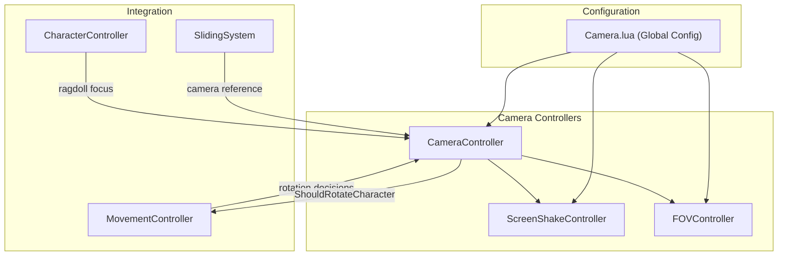

# CameraController

Comprehensive camera system supporting multiple view modes with collision detection, dynamic FOV, and screen shake effects.

## Overview

The CameraController manages the player's camera with three distinct modes, each optimized for different gameplay scenarios. It handles:

- Three camera modes: Orbit, Shoulder, FirstPerson
- Spherecast collision detection to prevent camera clipping
- Dynamic FOV based on velocity and movement states
- Screen shake effects for impacts and actions
- Smooth crouch/slide camera transitions
- Ragdoll camera focus
- Mobile and controller input support

## Architecture



## Camera Modes

### Mode A: Orbit (Default Roblox-like)

Traditional third-person camera that orbits around the character.

| Feature | Behavior |
|---------|----------|
| Cursor | Free (unlocked) |
| Rotation | Right-click drag to rotate |
| Zoom | Mouse wheel (2-25 studs range) |
| Character Rotation | Rotates to movement direction, NOT camera |
| Collision | Spherecast with configurable radius |

**When to use:** Exploration, general gameplay, or when the player needs to look around without affecting character direction.

```lua
Camera.Orbit = {
    Distance = 12,              -- Default distance from character
    MinDistance = 2,            -- Minimum zoom distance
    MaxDistance = 25,           -- Maximum zoom distance
    Height = 2,                 -- Height offset above character
    RotateCharacter = false,    -- Character follows movement, not camera
    CollisionRadius = 0.5,      -- Sphere cast radius
    CollisionBuffer = 0.5,      -- Buffer from collision point
}
```

---

### Mode B: Shoulder (Fortnite-style)

Over-the-shoulder third-person camera for combat scenarios.

| Feature | Behavior |
|---------|----------|
| Cursor | Locked to center |
| Rotation | Always rotating with mouse |
| Offset | Right shoulder (+1.75 X) |
| Character Rotation | Auto-rotates to camera yaw |
| Transparency | Distance-based rig fade (2-4 studs) |

**When to use:** Combat, aiming, or situations requiring precise directional control.

```lua
Camera.Shoulder = {
    Distance = 10,              -- Distance behind character
    Height = 0,                 -- Orbit around head level
    ShoulderOffsetX = 1.75,     -- Right shoulder offset (+X = right)
    ShoulderOffsetY = 0.15,     -- Vertical offset from shoulder
    RotateCharacter = true,     -- Character faces camera direction
    CollisionRadius = 0.5,
    CollisionBuffer = 1.0,
    MinCollisionDistance = 0.5,
}
```

---

### Mode C: FirstPerson

First-person view from the character's eyes.

| Feature | Behavior |
|---------|----------|
| Cursor | Locked to center |
| Rotation | Always rotating with mouse |
| Position | At head with configurable offset |
| Character Rotation | Auto-rotates to camera yaw |
| Rig Visibility | Hidden (LocalTransparencyModifier = 1) |

**When to use:** Immersive gameplay, precise aiming, indoor environments.

```lua
Camera.FirstPerson = {
    -- Position offset from head
    Offset = Vector3.new(0, .4, 0),

    -- Optional: Follow rig's visual Head instead of humanoid Head
    FollowHead = false,
    HeadOffset = Vector3.new(0, -.15, 0),
    HeadRotationOffset = Vector3.new(0, 0, 0), -- degrees (X,Y,Z)

    RotateCharacter = true,

    -- Prevents camera being forced above low ceilings
    DisableGroundClamp = true,
}
```

---

## Mode Switching

Players can cycle through camera modes using the configured key (default: `T`).

```
Orbit → Shoulder → FirstPerson → Orbit → ...
```

The cycle order is configurable:

```lua
Camera.CycleOrder = { "Orbit", "Shoulder", "FirstPerson" }
```

### Programmatic Mode Switching

```lua
-- Get the camera controller from registry
local cameraController = registry:Get("Camera")

-- Set a specific mode
cameraController:SetMode("FirstPerson")

-- Get current mode
local currentMode = cameraController:GetCurrentMode()
-- Returns: "Orbit", "Shoulder", or "FirstPerson"

-- Cycle to next mode
cameraController:CycleCameraMode()
```

---

## Lifecycle

```
Init(registry, net)
├── Set CameraType to Scriptable
├── Initialize FOVController
├── Initialize ScreenShakeController
├── SetupInput() (mouse, controller, touch)
├── StartCameraLoop() (RenderStep binding)
└── Connect to CharacterAdded/CharacterRemoving

OnCharacterSpawned(character)
├── Wait for character parts (PrimaryPart, Head, Rig)
├── InitializeCameraAngles()
├── ApplyCameraModeSettings()
├── ApplyRigVisibility()
└── HideColliderParts()

UpdateCamera() [per frame]
├── Check GameplayEnabled gate
├── Process controller/mobile input
├── Smooth camera angles
├── UpdateCrouchOffset()
├── Update mode-specific camera (Orbit/Shoulder/FirstPerson)
├── Apply mode transition blending
└── UpdateFOV()
```

---

## Public API

### Init(registry, net)

Initializes the camera controller with service registry and network layer.

```lua
CameraController:Init(registry, net)
```

**Behavior:**
- Sets camera to Scriptable mode
- Initializes FOV and ScreenShake controllers
- Sets up input handlers
- Starts the render loop
- Connects to character lifecycle events

---

### SetMode(modeName)

Switches to a specific camera mode.

```lua
local success = CameraController:SetMode("Shoulder")
```

**Parameters:**
- `modeName` - One of: `"Orbit"`, `"Shoulder"`, `"FirstPerson"`

**Returns:** `true` if mode was found and set, `false` otherwise

**Behavior:**
- Updates `CurrentMode` and `CurrentModeIndex`
- Calls `ApplyCameraModeSettings()` (cursor lock, rotation flag)
- Calls `ApplyRigVisibility()` (show/hide rig)
- Starts smooth mode transition

---

### GetCurrentMode()

Returns the current camera mode name.

```lua
local mode = CameraController:GetCurrentMode()
-- Returns: "Orbit", "Shoulder", or "FirstPerson"
```

---

### CycleCameraMode()

Cycles to the next camera mode in `Camera.CycleOrder`.

```lua
CameraController:CycleCameraMode()
```

Alias: `ToggleCameraMode()`

---

### ShouldRotateCharacterToCamera()

Returns whether the character should auto-rotate to face the camera direction.

```lua
local shouldRotate = CameraController:ShouldRotateCharacterToCamera()
-- Returns: true for Shoulder/FirstPerson, false for Orbit
```

**Used by:** MovementController to decide character rotation behavior.

---

### SetRagdollFocus(ragdollHead)

Sets the camera to follow a ragdoll's head (for death/knockback).

```lua
CameraController:SetRagdollFocus(ragdollHead)
```

**Parameters:**
- `ragdollHead` - The ragdoll's Head BasePart to follow

**Behavior:**
- Saves current mode as `PreRagdollMode`
- Forces camera to Orbit mode
- Sets `RagdollSubject` for orbit pivot

---

### ClearRagdollFocus()

Clears ragdoll camera focus, allowing normal character following.

```lua
CameraController:ClearRagdollFocus()
```

---

### GetCameraAngles()

Returns the current camera pitch and yaw angles.

```lua
local angles = CameraController:GetCameraAngles()
-- Returns: Vector2.new(yaw, pitch) in degrees
```

---

### SetFOV(fov)

Directly sets the camera's field of view.

```lua
CameraController:SetFOV(90)
```

**Note:** This is overridden by FOVController on the next frame unless FOV effects are disabled.

---

### Cleanup()

Disconnects all connections and clears state.

```lua
CameraController:Cleanup()
```

---

## FOV System

The FOVController provides dynamic field of view changes based on player velocity and movement states.

### Configuration

```lua
Camera.FOV = {
    Base = 80,                  -- Base field of view

    -- Velocity-based FOV
    Velocity = {
        Enabled = true,
        MinSpeed = 22,          -- Speed threshold to start FOV increase
        MaxSpeed = 140,         -- Speed at max FOV boost
        MinBoost = 0,           -- FOV boost at min speed
        MaxBoost = 12,          -- FOV boost at max speed
    },

    -- State-based FOV effects
    Effects = {
        Enabled = true,
        Slide = 5,              -- FOV increase during slide
        Sprint = 3,             -- FOV increase during sprint
    },

    LerpAlpha = 0.08,           -- Transition smoothness
}
```

### Effect Priority

When multiple effects are active, the highest priority wins:

| Effect | Priority | Typical Delta |
|--------|----------|---------------|
| Velocity | 1 | 0-12 (speed-based) |
| Sprint | 2 | +3 |
| Slide | 3 | +5 |

### FOVController API

```lua
-- Add a custom FOV effect
FOVController:AddEffect("CustomZoom", 10)

-- Remove an effect
FOVController:RemoveEffect("Sprint")

-- Set base FOV
FOVController:SetBaseFOV(75)

-- Get current FOV
local fov = FOVController:GetCurrentFOV()

-- Reset all effects
FOVController:Reset()
```

---

## Screen Shake System

The ScreenShakeController provides camera shake effects for impacts and actions.

### Configuration

```lua
Camera.ScreenShake = {
    Enabled = true,
    WallJump = {
        Intensity = 0.3,
        Duration = 0.2,
        Frequency = 15,
    },
    Land = {
        Enabled = true,
        IntensityMultiplier = 0.01,
        MaxIntensity = 0.5,
        Duration = 0.15,
        Frequency = 20,
    },
}
```

### ScreenShakeController API

```lua
-- Generic shake
local shakeId = ScreenShakeController:Shake(intensity, duration, frequency)
-- intensity: 0.0-1.0 shake magnitude
-- duration: seconds
-- frequency: oscillations per second

-- Preset: Wall jump shake
ScreenShakeController:ShakeWallJump()

-- Stop a specific shake
ScreenShakeController:StopShake(shakeId)

-- Stop all active shakes
ScreenShakeController:StopAllShakes()

-- Get current shake offset (used by CameraController)
local offset = ScreenShakeController:GetOffset()      -- Vector3
local rotation = ScreenShakeController:GetRotation()  -- Vector3 (degrees)
```

### Shake Decay

Shakes automatically decay over their duration:

```
intensity = baseIntensity * (1 - progress)
```

Where `progress = elapsed / duration`.

---

## Configuration Reference

All camera settings are in `src/ReplicatedStorage/Global/Camera.lua`:

### General Settings

```lua
Camera.Modes = {
    Orbit = "Orbit",
    Shoulder = "Shoulder",
    FirstPerson = "FirstPerson",
}

Camera.DefaultMode = "Orbit"
Camera.CycleOrder = { "Orbit", "Shoulder", "FirstPerson" }
```

### Sensitivity

```lua
Camera.Sensitivity = {
    Mouse = 0.4,
    Touch = 1.0,
    MobileHorizontal = 3.75,
    MobileVertical = 1.0,
    ControllerX = 6,
    ControllerY = 6,
}
```

### Angle Limits

```lua
Camera.AngleLimits = {
    MinVertical = -80,  -- Look down limit (degrees)
    MaxVertical = 80,   -- Look up limit (degrees)
}
```

### Smoothing

```lua
Camera.Smoothing = {
    AngleSmoothness = 50,       -- Higher = smoother rotation
    CrouchTransitionSpeed = 12,
    EnableCrouchTransition = true,
    ModeTransitionTime = 0.067, -- Blend time between modes
}
```

### Slide Camera Effects

```lua
Camera.SlideEffects = {
    FOV = 85,
    FOVTweenTime = 0.1,
    CameraDrop = 2,
    CameraDropTime = 0.1,
}
```

---

## Integration with Other Systems

### MovementController Integration

The MovementController queries CameraController for rotation decisions:

```lua
-- MovementController checks if character should rotate to camera
local shouldRotate = self.CameraController:ShouldRotateCharacterToCamera()

if shouldRotate then
    -- Rotate character to face camera yaw (Shoulder/FirstPerson)
else
    -- Rotate character to movement direction (Orbit)
end
```

### SlidingSystem Integration

The SlidingSystem receives a camera controller reference for slide camera effects:

```lua
SlidingSystem:SetCameraController(self.CameraController)
```

### Character Lifecycle

CameraController automatically handles character spawning/removal:

- **OnCharacterSpawned:** Waits for parts, initializes angles, applies visibility
- **OnCharacterRemoving:** Unbinds render loop, clears state

---

## Collision Detection

All third-person modes use spherecast collision to prevent camera clipping:

```lua
local spherecastResult = workspace:Spherecast(
    rayOrigin,           -- Pivot point (character head/position)
    collisionRadius,     -- 0.5 studs default
    rayDirection,        -- To desired camera position
    raycastParams        -- Excludes character, rig, ragdolls
)

if spherecastResult then
    -- Pull camera forward to safe distance
    local safeDistance = hitDistance - collisionBuffer
    finalPosition = rayOrigin + (direction * safeDistance)
end
```

### Excluded from Collision

- Player's character
- Player's rig
- `workspace.Rigs` folder (all rigs)
- `workspace.Ragdolls` folder (all ragdolls)

---

## Ground Clamping

Camera positions are clamped above terrain to prevent underground views:

```lua
function CameraController:_clampPositionAboveGround(pos, clearance)
    -- Raycast down from above the position
    -- If ground found, ensure camera is at least `clearance` above it
end
```

**Note:** FirstPerson mode can disable this via `DisableGroundClamp = true` to allow cameras in low-ceiling areas.

---

## Related Files

| File | Purpose |
|------|---------|
| `src/StarterPlayer/StarterPlayerScripts/Initializer/Controllers/Camera/CameraController.lua` | Main camera controller |
| `src/StarterPlayer/StarterPlayerScripts/Initializer/Controllers/Camera/ScreenShakeController.lua` | Screen shake effects |
| `src/ReplicatedStorage/Global/Camera.lua` | All camera configuration |
| `src/ReplicatedStorage/Shared/Util/FOVController.lua` | Dynamic FOV system |
| `src/ReplicatedStorage/Shared/Config/Config.lua` | Config loader (includes Camera) |
| `src/StarterPlayer/StarterPlayerScripts/Initializer/Controllers/Movement/MovementController.lua` | Uses camera for rotation |
