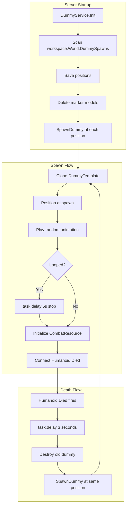

# Dummy Target System

Server-side system that spawns combat test dummies at designated spawn points with full emote and combat integration.

## Overview

The Dummy System provides static target dummies for testing:
- Weapon damage
- Status effects (Burn, Bleed, Frozen, etc.)
- Damage numbers
- Combat mechanics

Dummies spawn at designated markers, play random emotes on spawn, and respawn automatically after death.

## Architecture



## File Locations

| Component | Path |
|-----------|------|
| DummyService | `src/ServerScriptService/Server/Services/Dummy/DummyService.lua` |
| DummyConfig | `src/ReplicatedStorage/Configs/DummyConfig.lua` |

---

## Setup

### 1. Create Dummy Template

Create a character model named `Dummy` in `ServerStorage/Models/` with this structure:

```
ServerStorage/
└── Models/
    └── Dummy (Model)
        ├── Humanoid (for health tracking)
        ├── Collider (Folder) - hitbox parts
        ├── Rig (Model) - R6 visual rig with Humanoid + Animator
        └── Root (Part) - the physics "bean"
            ├── Body, Feet, Head - welded collider parts
            ├── CrouchBody, CrouchHead
            ├── CollisionBody, CollisionHead
            └── HumanoidRootPart
```

**Key requirements:**
- `Root` is the physics part (unanchored, can collide)
- `Rig` contains R6 parts with Motor6Ds for animation
- `Rig` must have its own `Humanoid` with `Animator` child
- Collider parts are for raycasting (hitboxes)
- DummyService auto-welds parts if not pre-welded

### 2. Place Spawn Markers

Create spawn markers in `workspace/World/DummySpawns/`:

```
workspace/
└── World/
    └── DummySpawns (Folder)
        ├── DummySpawn (Model or Part)
        ├── DummySpawn (Model or Part)
        └── ...
```

Each marker should be named `DummySpawn`. The service reads their position/CFrame and then destroys them, spawning actual dummies in their place.

**Marker Structure (Model):**
```lua
Model {
    Name = "DummySpawn",
    PrimaryPart = HumanoidRootPart,
    [Children] = {
        Part { Name = "HumanoidRootPart" },
    }
}
```

**Or simple Part:**
```lua
Part {
    Name = "DummySpawn",
    -- Position where dummy spawns
}
```

---

## Configuration

**Location:** `src/ReplicatedStorage/Configs/DummyConfig.lua`

```lua
local DummyConfig = {}

-- Spawn markers location
DummyConfig.SpawnFolder = "workspace.World.DummySpawns"
DummyConfig.MarkerName = "DummySpawn"

-- Template location
DummyConfig.TemplatePath = "ServerStorage.Models.Dummy"

-- Dummy settings
DummyConfig.Health = 150
DummyConfig.MaxHealth = 150

-- Respawn settings
DummyConfig.RespawnDelay = 3  -- Seconds after death

-- Spawn emote settings
DummyConfig.SpawnEmote = {
    Enabled = true,
    LoopDuration = 5,  -- Stop looped emotes after 5 seconds
}

-- Combat integration
DummyConfig.CombatEnabled = true

return DummyConfig
```

---

## Server API

### DummyService

**Location:** `src/ServerScriptService/Server/Services/Dummy/DummyService.lua`

#### Methods

```lua
-- Get all active dummy models
DummyService:GetDummies(): { Model }

-- Get count of active dummies
DummyService:GetDummyCount(): number

-- Spawn a dummy at a specific position (for testing)
DummyService:SpawnAt(position: Vector3): Model?

-- Destroy all dummies (does not respawn)
DummyService:DestroyAll()

-- Destroy and respawn all dummies
DummyService:RespawnAll()
```

#### Usage Example

```lua
local registry = -- get registry

local dummyService = registry:Get("DummyService")

-- Get all dummies
local dummies = dummyService:GetDummies()
print("Active dummies:", #dummies)

-- Spawn extra dummy for testing
local newDummy = dummyService:SpawnAt(Vector3.new(0, 5, 0))

-- Reset all dummies
dummyService:RespawnAll()
```

---

## Combat Integration

Each dummy is registered with CombatService using a pseudo-player object:

```lua
local pseudoPlayer = {
    UserId = -1,  -- Negative ID to distinguish from real players
    Name = "Dummy_1",
    Character = dummyModel,
}
```

This enables:
- **Health tracking** via CombatResource
- **Status effects** (Burn, Bleed, Frozen, Heal)
- **Damage numbers** display
- **I-frames** and invulnerability

### Applying Damage

Use `CombatService:ApplyDamage()` or attack dummies with weapons:

```lua
local combatService = registry:Get("CombatService")

-- Find dummy's pseudo-player
for dummy, info in pairs(dummyService._activeDummies) do
    combatService:ApplyDamage(info.pseudoPlayer, 50, {
        source = player,
        weaponId = "TestWeapon",
    })
end
```

### Status Effects

Apply status effects to dummies:

```lua
combatService:ApplyStatusEffect(pseudoPlayer, "Burn", {
    duration = 5,
    damagePerTick = 10,
})

combatService:ApplyStatusEffect(pseudoPlayer, "Frozen", {
    duration = 3,
    breakOnDamage = true,
})
```

---

## Spawn Emote System

On spawn, each dummy plays a random emote using the proper `EmoteBase` system:

1. Service scans `ReplicatedStorage/Game/Emotes/Emotes/` for emote modules
2. Falls back to `ReplicatedStorage/Assets/Animations/Emotes/` if no modules found
3. Creates `EmoteBase` instance with dummy's Rig
4. Calls `emote:start()` and `emote:PlayAnimation("Main")`
5. Looped emotes stop after `LoopDuration` seconds (default 5)

This uses the full emote system with proper lifecycle and animations.

---

## Lifecycle

### Spawn Flow

1. **Init** - Cache template, initialize EmoteService
2. **Start** - Scan markers, record positions, destroy markers
3. **Spawn** - Clone template, position, play emote, init combat
4. **Death** - Humanoid.Died fires, cleanup, respawn after delay

### Death & Respawn

```lua
humanoid.Died:Once(function()
    -- Stop emotes
    EmoteService.stopOnRig(nil, dummy)
    
    -- Cleanup combat
    combatService:CleanupPlayer(pseudoPlayer)
    
    -- Respawn after delay
    task.delay(DummyConfig.RespawnDelay, function()
        dummy:Destroy()
        spawnDummy(spawnIndex)
    end)
end)
```

No RunService loops - purely event-driven and `task.delay` based.

---

## Troubleshooting

### Dummies not spawning

1. Check `ServerStorage/Models/Dummy` exists
2. Check `workspace/World/DummySpawns` folder exists
3. Check markers are named `DummySpawn`
4. Check console for `[DummyService]` warnings

### Emotes not playing

1. Ensure EmoteService has registered emotes
2. Check dummy has `Humanoid` with `Animator`
3. Verify emote animations are accessible

### Combat not working

1. Ensure `DummyConfig.CombatEnabled = true`
2. Check CombatService is registered before DummyService
3. Verify dummy has `Humanoid` for health tracking
