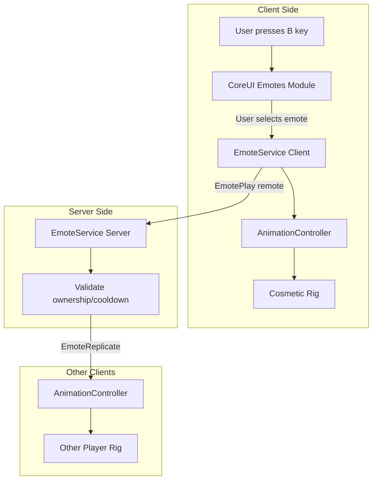

# Emote System

Complete emote system with radial wheel UI, animation playback on cosmetic rigs, and multiplayer replication.

## Architecture Overview



## File Locations

| Component | Path |
|-----------|------|
| Client EmoteService | `src/ReplicatedStorage/Game/Emotes/init.lua` |
| EmoteBase Class | `src/ReplicatedStorage/Game/Emotes/EmoteBase.lua` |
| Emote Modules | `src/ReplicatedStorage/Game/Emotes/Emotes/*.lua` |
| Server EmoteService | `src/ServerScriptService/Server/Services/Emote/EmoteService.lua` |
| CoreUI Radial Wheel | `src/ReplicatedStorage/CoreUI/Modules/Emotes/init.lua` |
| EmoteConfig | `src/ReplicatedStorage/Configs/EmoteConfig.lua` |
| Player Data | `src/ReplicatedStorage/PlayerDataTable.lua` |
| Animation Controller | `src/StarterPlayer/StarterPlayerScripts/Initializer/Controllers/Character/AnimationController.lua` |

---

## Creating Emotes

### Animation Definition

**Recommended:** Define animation IDs directly in the emote module's `Animations` table:

```lua
YourEmote.Animations = {
    Main = "rbxassetid://123456789", -- Primary emote animation
}
```

The EmoteService preloads all animation IDs when it initializes.

### Optional Asset Folder Structure (Legacy/Fallback)

For sound effects and VFX, or as a fallback for animations:

```
Assets/
└── Animations/
    └── Emotes/
        └── {EmoteId}/
            ├── Animation/       -- Fallback if not defined in Animations table
            │   └── Emote.animation
            ├── Sound/           -- Optional: Sound effects
            │   └── Sound.sound
            └── VFX/             -- Optional: Visual effects (future)
```

### Emote Module Template

Create a new file at `src/ReplicatedStorage/Game/Emotes/Emotes/{YourEmoteId}.lua`:

```lua
local EmoteBase = require(script.Parent.Parent.EmoteBase)

local YourEmote = setmetatable({}, { __index = EmoteBase })
YourEmote.__index = YourEmote

--[[ REQUIRED SETTINGS ]]--

-- Unique identifier
YourEmote.Id = "YourEmoteId"

-- Display name shown in the emote wheel UI
YourEmote.DisplayName = "Your Emote Name"

-- Rarity tier: Common, Rare, Epic, Legendary, Mythic
YourEmote.Rarity = "Common"

--[[ ANIMATIONS TABLE ]]--
-- Define animation IDs here for preloading and playback
-- These are preloaded when EmoteService initializes
YourEmote.Animations = {
    Main = "rbxassetid://123456789", -- Primary emote animation
    -- Add more animation keys as needed:
    -- Intro = "rbxassetid://...",
    -- Loop = "rbxassetid://...",
    -- Outro = "rbxassetid://...",
}

--[[ BEHAVIOR SETTINGS ]]--

-- If true, animation loops until manually stopped
YourEmote.Loopable = false

-- If true, player can move while emoting
-- If false, movement cancels the emote
YourEmote.AllowMove = true

-- Animation playback speed multiplier (1 = normal)
YourEmote.Speed = 1

--[[ OPTIONAL: Animation timing overrides ]]--
-- YourEmote.FadeInTime = 0.2
-- YourEmote.FadeOutTime = 0.2

--[[ OPTIONAL: Custom constructor ]]--
function YourEmote.new(emoteId, emoteData, rig)
    local self = EmoteBase.new(emoteId, emoteData, rig)
    setmetatable(self, YourEmote)
    
    -- Custom initialization (spawn props, etc.)
    
    return self
end

--[[ OPTIONAL: Custom start behavior ]]--
function YourEmote:start()
    -- Pre-animation logic (spawn props, play intro sound)
    
    return EmoteBase.start(self)
end

--[[ OPTIONAL: Custom stop behavior ]]--
function YourEmote:stop()
    -- Cleanup logic (remove props, play outro sound)
    
    return EmoteBase.stop(self)
end

return YourEmote
```

### Step-by-Step: Adding a New Emote

1. **Get Your Animation ID**
   - Upload your animation to Roblox and get the asset ID
   - Format: `rbxassetid://123456789`

2. **Create the Emote Module**
   - Copy `Template.lua` to `src/ReplicatedStorage/Game/Emotes/Emotes/{EmoteId}.lua`
   - Set `Id` to your emote name
   - Add your animation ID to the `Animations` table:
     ```lua
     YourEmote.Animations = {
         Main = "rbxassetid://123456789",
     }
     ```
   - Configure `DisplayName`, `Rarity`, and behavior settings

3. **Add to Player Inventory (Optional)**
   - Call `PlayerDataTable.addOwnedEmote(emoteId)` to give ownership
   - Call `PlayerDataTable.setEquippedEmote("Slot1", emoteId)` to equip

4. **Test**
   - Press B (or configured keybind) to open the emote wheel
   - Select your emote slot to play

---

## Client API

### EmoteService

**Location:** `src/ReplicatedStorage/Game/Emotes/init.lua`

The main client-side service for emote playback.

#### Methods

```lua
-- Initialize the service (called automatically)
-- Loads emote modules and preloads animation assets
EmoteService.init()

-- Play an emote by ID (local player)
-- Returns: boolean (success)
EmoteService.play(emoteId: string): boolean

-- Stop the current emote (local player)
-- Returns: boolean (success)
EmoteService.stop(): boolean

-- Stop all emotes (alias for stop)
EmoteService.stopAll(): boolean

-- Check if an emote is currently playing
EmoteService.isPlaying(): boolean

-- Get the current emote ID
EmoteService.getCurrentEmoteId(): string?

-- Get emote info for UI display
EmoteService.getEmoteInfo(emoteId: string): {
    id: string,
    displayName: string,
    rarity: string
}?

-- Get emote data (full configuration)
EmoteService.getEmoteData(emoteId: string): { [string]: any }?

-- Get list of all registered emote IDs
EmoteService.getEmoteIds(): { string }

-- Get list of all registered emote classes
EmoteService.getEmoteList(): { { [string]: any } }

-- Get rarity of an emote
EmoteService.getEmoteRarity(emoteId: string): string?

-- Get registered emote class
EmoteService.getEmoteClass(emoteId: string): { [string]: any }?

-- Register a custom emote class
EmoteService.register(emoteClass: { [string]: any }): boolean

-- ============================================
-- PREVIEW RIG METHODS (for viewport previews)
-- ============================================

-- Play emote on a specific rig (no server replication)
-- Used by UI for viewport preview animations
EmoteService.playOnRig(emoteId: string, rig: Model): boolean

-- Stop emote on a specific rig
-- If emoteId is nil, stops all emotes on the rig
EmoteService.stopOnRig(emoteId: string?, rig: Model): boolean

-- Cleanup
EmoteService.destroy()
```

#### Usage Example

```lua
local EmoteService = require(ReplicatedStorage.Game.Emotes)

-- Initialize
EmoteService.init()

-- Play an emote
local success = EmoteService.play("Wave")
if success then
    print("Playing Wave emote!")
end

-- Check if playing
if EmoteService.isPlaying() then
    local currentId = EmoteService.getCurrentEmoteId()
    print("Currently playing:", currentId)
end

-- Stop the emote
EmoteService.stop()
```

---

### EmoteBase

**Location:** `src/ReplicatedStorage/Game/Emotes/EmoteBase.lua`

Base class for all emote modules.

#### Static Properties

| Property | Type | Default | Description |
|----------|------|---------|-------------|
| `Id` | string | "EmoteBase" | Unique identifier |
| `DisplayName` | string | "Emote" | UI display name |
| `Rarity` | string | "Common" | Rarity tier |
| `Animations` | table | {} | Animation IDs: `{ Main = "rbxassetid://..." }` |
| `Loopable` | boolean | false | Whether animation loops |
| `AllowMove` | boolean | true | Whether movement cancels emote |
| `Speed` | number | 1 | Animation speed multiplier |
| `FadeInTime` | number | 0.2 | Animation fade in duration |
| `FadeOutTime` | number | 0.2 | Animation fade out duration |

#### Methods

```lua
-- Create a new emote instance
EmoteBase.new(emoteId: string, emoteData: table, rig: Model?): EmoteBase

-- Start playing the emote
-- Returns: boolean (success)
emote:start(): boolean

-- Stop the emote
-- Returns: boolean (success)
emote:stop(): boolean

-- Alias for stop()
emote:endEmote(): boolean

-- Set callback for when emote finishes
emote:onFinished(callback: () -> ())

-- Get emote info
emote:getInfo(): { id: string, displayName: string, rarity: string }

-- Check if emote is active
emote:isActive(): boolean

-- Cleanup
emote:destroy()
```

---

### AnimationController Emote Methods

**Location:** `src/StarterPlayer/StarterPlayerScripts/Initializer/Controllers/Character/AnimationController.lua`

Methods added to the existing AnimationController for emote playback.

#### Properties

```lua
-- Current emote track for local player
AnimationController.CurrentEmoteTrack: AnimationTrack?

-- Cache of loaded emote animations
AnimationController.EmoteAnimationCache: { [string]: Animation }

-- Emote tracks for other players
AnimationController.OtherCharacterEmoteTracks: { [Model]: AnimationTrack }
```

#### Methods

```lua
-- Play an emote on the local player's rig
-- Returns: boolean (success)
AnimationController:PlayEmote(emoteId: string): boolean

-- Stop the current emote
-- Returns: boolean (success)
AnimationController:StopEmote(): boolean

-- Check if an emote is playing
AnimationController:IsEmotePlaying(): boolean

-- Play an emote on another player's rig (for replication)
-- Returns: boolean (success)
AnimationController:PlayEmoteForOtherPlayer(player: Player, emoteId: string): boolean

-- Stop emote for another player
-- Returns: boolean (success)
AnimationController:StopEmoteForOtherPlayer(player: Player): boolean
```

---

## Server API

### EmoteService (Server)

**Location:** `src/ServerScriptService/Server/Services/Emote/EmoteService.lua`

Server-side validation and replication.

#### Properties

```lua
-- Active emotes per player
EmoteService.ActiveEmotes: { [Player]: { emoteId: string, startTime: number } }

-- Last emote time for cooldown
EmoteService.LastEmoteTime: { [Player]: number }
```

#### Methods

```lua
-- Get active emote for a player
EmoteService:GetActiveEmote(player: Player): { emoteId: string, startTime: number }?

-- Check if player is currently emoting
EmoteService:IsEmoting(player: Player): boolean

-- Force stop emote for a player (e.g., on death)
EmoteService:ForceStopEmote(player: Player)
```

#### Validation Flow

1. Client sends `EmotePlay` remote with emoteId
2. Server validates:
   - emoteId is a non-empty string
   - Cooldown has elapsed (0.5s default)
   - Player owns the emote (optional, can be enabled)
3. If valid, broadcasts `EmoteReplicate` to all other clients
4. Other clients play the emote via `AnimationController:PlayEmoteForOtherPlayer()`

---

## UI Integration

### CoreUI Emotes Module

**Location:** `src/ReplicatedStorage/CoreUI/Modules/Emotes/init.lua`

Radial wheel UI for emote selection.

#### Required UI Element Structure

The module expects a UI frame named `Emotes` in your ScreenGui with this structure:

```
Emotes (Frame/CanvasGroup)
├── Root (CanvasGroup) - Main wheel container
│   ├── UIScale
│   ├── Slot1 (Frame)
│   │   ├── Icon (ImageLabel) - Emote icon
│   │   ├── Bar (Frame) - Hover highlight
│   │   ├── Button (TextButton/ImageButton) - Click target
│   │   ├── UIScale
│   │   └── Name (TextLabel) - Optional name display
│   ├── Slot2 ... Slot8 (same structure)
└── Info (CanvasGroup) - Optional info panel
    ├── Name (TextLabel)
    └── Rarity (TextLabel)
```

#### Slot Angles (8-slot wheel)

| Slot | Angle | Position |
|------|-------|----------|
| 1 | -90° | Top |
| 2 | -45° | Top-Right |
| 3 | 0° | Right |
| 4 | 45° | Bottom-Right |
| 5 | 90° | Bottom |
| 6 | 135° | Bottom-Left |
| 7 | 180° | Left |
| 8 | -135° | Top-Left |

#### Input Handling

- **Mouse:** Hover position determines selected slot
- **Gamepad:** Left thumbstick direction selects slot
- **Click/Tap:** Activates the hovered slot
- **B Key / DPad Down:** Opens wheel (behavior depends on EmoteWheelMode setting)

#### Module Methods

```lua
-- Get currently hovered slot index
module:getHoveredSlot(): number?

-- Get equipped emotes table
module:getEquippedEmotes(): { [string]: string? }

-- Refresh equipped emotes from PlayerDataTable
module:refreshEmotes()
```

---

## Player Data

### EQUIPPED_EMOTES Structure

**Location:** `src/ReplicatedStorage/PlayerDataTable.lua`

```lua
mockData.EQUIPPED_EMOTES = {
    Slot1 = nil,  -- or emoteId string
    Slot2 = nil,
    Slot3 = nil,
    Slot4 = nil,
    Slot5 = nil,
    Slot6 = nil,
    Slot7 = nil,
    Slot8 = nil,
}

mockData.OWNED.OWNED_EMOTES = {}  -- Array of owned emote IDs
```

### Helper Methods

```lua
-- Get all equipped emotes
PlayerDataTable.getEquippedEmotes(): { [string]: string? }

-- Equip an emote to a slot
PlayerDataTable.setEquippedEmote(slot: string, emoteId: string?): boolean

-- Check if player owns an emote
PlayerDataTable.isEmoteOwned(emoteId: string): boolean

-- Get all owned emotes
PlayerDataTable.getOwnedEmotes(): { string }

-- Add an emote to owned list
PlayerDataTable.addOwnedEmote(emoteId: string): boolean
```

#### Usage Example

```lua
local PlayerDataTable = require(ReplicatedStorage.PlayerDataTable)

-- Initialize
PlayerDataTable.init()

-- Give player an emote
PlayerDataTable.addOwnedEmote("Wave")

-- Equip to slot 1
PlayerDataTable.setEquippedEmote("Slot1", "Wave")

-- Check ownership
if PlayerDataTable.isEmoteOwned("Wave") then
    print("Player owns Wave emote")
end

-- Get all equipped
local equipped = PlayerDataTable.getEquippedEmotes()
print("Slot 1:", equipped.Slot1)
```

---

## Configuration

### EmoteConfig

**Location:** `src/ReplicatedStorage/Configs/EmoteConfig.lua`

#### Rarity Colors

```lua
EmoteConfig.Rarities = {
    Common    = { Color = Color3.fromRGB(180, 180, 180), Order = 1 },
    Rare      = { Color = Color3.fromRGB(30, 144, 255),  Order = 2 },
    Epic      = { Color = Color3.fromRGB(163, 53, 238),  Order = 3 },
    Legendary = { Color = Color3.fromRGB(255, 165, 0),   Order = 4 },
    Mythic    = { Color = Color3.fromRGB(255, 0, 85),    Order = 5 },
}
```

#### Default Settings

```lua
EmoteConfig.Defaults = {
    Loopable = false,
    AllowMove = true,
    Speed = 1,
    FadeInTime = 0.2,
    FadeOutTime = 0.2,
    Priority = Enum.AnimationPriority.Action,
}
```

#### Cooldown Settings

```lua
EmoteConfig.Cooldown = {
    Enabled = true,
    Duration = 0.5,  -- seconds between emotes
}
```

#### Helper Functions

```lua
-- Get color for a rarity
EmoteConfig.getRarityColor(rarity: string): Color3

-- Get full rarity info
EmoteConfig.getRarityInfo(rarity: string): { Name: string, Color: Color3, Order: number }?

-- Validate emote ID format
EmoteConfig.isValidEmoteId(emoteId: any): boolean

-- Get rarities sorted by order
EmoteConfig.getRaritiesSorted(): { string }
```

---

### Settings Keybind & Mode

**Location:** `src/ReplicatedStorage/Configs/SettingsConfig/init.lua`

The emote wheel keybind is configured in the Controls category:

```lua
Emotes = {
    Name = "Emote Wheel",
    Description = "Open the emote selection wheel.",
    Order = 17,
    SettingType = "keybind",
    Action = "Emotes",
    Bind = {
        PC = Enum.KeyCode.B,
        PC2 = nil,
        Console = Enum.KeyCode.DPadDown,
    },
}
```

Default bindings:
- **PC:** B key
- **Console:** DPad Down

### Emote Wheel Mode Setting

Controls how the emote wheel opens and closes:

```lua
EmoteWheelMode = {
    Name = "Emote Wheel Mode",
    Description = "Hold: Release to select. Toggle: Press again to close.",
    Order = 18,
    SettingType = "toggle",
    Options = {
        { Display = "Hold", Value = "Hold" },
        { Display = "Toggle", Value = "Toggle" },
    },
    Default = 1, -- Hold mode
}
```

#### Mode Behaviors

| Mode | Open | Close | Select |
|------|------|-------|--------|
| **Hold** | Press B | Release B | Release B (selects hovered) |
| **Toggle** | Press B | Press B again | Click slot or press B |

**Hold Mode (Default):**
- Press and hold B to open the wheel
- Move mouse/stick to hover over emotes
- Release B to select the hovered emote and close

**Toggle Mode:**
- Press B to open the wheel
- Move mouse/stick to hover over emotes
- Click a slot to select, OR press B again to close without selecting

#### Reading the Setting

```lua
local PlayerDataTable = require(ReplicatedStorage.PlayerDataTable)

-- Get mode index (1 = Hold, 2 = Toggle)
local modeIndex = PlayerDataTable.get("Controls", "EmoteWheelMode")
local isHoldMode = (modeIndex == nil or modeIndex == 1)
```

---

## Remotes

**Location:** `src/ReplicatedStorage/Shared/Net/Remotes.lua`

### EmotePlay

Client requests to play an emote.

```lua
-- Client -> Server
Net:FireServer("EmotePlay", emoteId: string)
```

### EmoteStop

Client requests to stop current emote.

```lua
-- Client -> Server
Net:FireServer("EmoteStop")
```

### EmoteReplicate

Server broadcasts emote to other clients.

```lua
-- Server -> Client
-- Parameters: playerId, emoteId, action ("play" or "stop")
Net:ConnectClient("EmoteReplicate", function(playerId, emoteId, action)
    if action == "play" then
        -- Play emote for this player
    elseif action == "stop" then
        -- Stop emote for this player
    end
end)
```

---

## Data Flow Summary

1. **Opening the Wheel**
   - User presses B key
   - Input system detects keybind
   - `CoreUI:show("Emotes")` opens radial wheel

2. **Selecting an Emote**
   - User moves mouse/thumbstick to hover slot
   - UI highlights hovered slot
   - User clicks/taps to confirm

3. **Playing Locally**
   - CoreUI calls `EmoteService.play(emoteId)`
   - EmoteService creates emote instance
   - `AnimationController:PlayEmote()` plays animation on cosmetic rig
   - Emote instance handles movement cancellation if needed

4. **Server Validation**
   - `EmoteService.play()` fires `EmotePlay` to server
   - Server validates cooldown and ownership
   - Server records active emote for player

5. **Replication**
   - Server broadcasts `EmoteReplicate` to all other clients
   - Other clients receive playerId, emoteId, action
   - `AnimationController:PlayEmoteForOtherPlayer()` plays on that player's rig

6. **Stopping**
   - Emote ends naturally (animation finishes) or
   - User moves (if `AllowMove = false`) or
   - `EmoteService.stop()` is called
   - Server broadcasts stop to other clients
