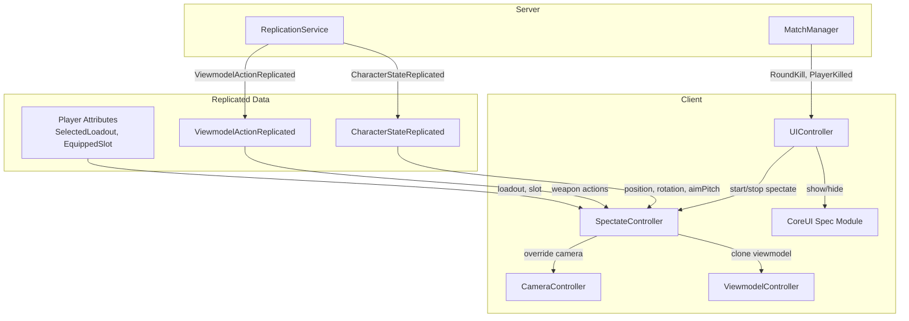

# Spectate System

True first-person spectating system for competitive matches. When eliminated, the player's camera and viewmodel seamlessly transition to show exactly what another player sees — their weapon, abilities, ADS, recoil, everything.

## Overview

- **1v1 (Duel):** Spectate your killer (enemy). No arrows.
- **2v2 (TwoVTwo):** Spectate your living teammate. No arrows. Never spectate enemies.
- **3v3+ (ThreeVThree, FourVFour):** Spectate living teammates with left/right arrow buttons to cycle.
- Spectating begins **immediately on death** (Kill UI overlays on top).
- Spectating ends on **round reset** (`RoundOutcome`, `ShowRoundLoadout`, `BetweenRoundFreeze`, or `ReturnToLobby`).

## Architecture



## Character Architecture Context

The game uses a three-layer character system:

| Layer | Location | Purpose | Visible To |
|-------|----------|---------|------------|
| **Character** | `workspace.Entities` | Physics/collision (`Root`, `Collider`, `HumanoidRootPart`) | Nobody (invisible) |
| **Rig** | `workspace.Rigs` | Visual R15 body (what players see in third person) | All players |
| **Viewmodel** | `workspace.CurrentCamera` | First-person weapon + arms | Local player only |

For spectating, we need to:
1. Position the camera at the target's Rig Head
2. Create a viewmodel clone for the target's current weapon
3. Hide the target's Rig (same as first-person transparency)

## Existing Replication Pipeline

### Character State (position, rotation, animation)

```
ClientReplicator.SendStateUpdate()
  → CharacterStateUpdate (unreliable remote)
  → ReplicationService.OnClientStateUpdate()
  → BroadcastStates() → CharacterStateReplicated (batched, match-scoped)
  → RemoteReplicator.OnStatesReplicated()
  → Interpolated rig positioning per frame
```

State payload includes: `Position`, `Rotation`, `Velocity`, `AnimationId`, `AimPitch`, `RigTilt`, `IsGrounded`, `SequenceNumber`, `Timestamp`.

### Viewmodel Actions (weapon state)

```
ClientReplicator.ReplicateViewmodelAction(weaponId, actionName, trackName, isActive)
  → ViewmodelActionUpdate (compressed)
  → ReplicationService.OnViewmodelActionUpdate()
  → ViewmodelActionReplicated (match-scoped fanout, excluding sender)
  → RemoteReplicator._applyReplicatedViewmodelAction()
  → ThirdPersonWeaponManager.ApplyReplicatedAction()
```

Action types: `Equip`, `Unequip`, `ADS` (stateful), `PlayWeaponTrack` (Fire, Reload, Inspect — stateful), `PlayAnimation`.

Stateful actions are tracked by the server in `PlayerActiveViewmodelActions[player]` and sent as a `ViewmodelActionSnapshot` when a client signals `ClientReplicationReady`.

### Player Attributes (already replicated by Roblox)

- `SelectedLoadout` — JSON string: `{ loadout: { Primary: "AssaultRifle", Secondary: "Revolver", Melee: "Tomahawk" } }`
- `EquippedSlot` — `"Primary"`, `"Secondary"`, `"Melee"`, or `"Fists"`

## Camera System Context

`CameraController` always runs in `Enum.CameraType.Scriptable` mode:
- Bound to `RenderStep` at `Camera.Value + 10`
- In FirstPerson mode: camera CFrame = `RigHead.Position` + yaw/pitch angles + screen shake
- On death: switches to Orbit mode via `SetRagdollFocus(ragdollHead)` to watch ragdoll

For spectating, we override the camera to track the spectated player's head and aim angles instead of the ragdoll.

## Viewmodel System Context

`ViewmodelController`:
- Bound to `RenderStep` at `Camera.Value + 12` (after camera)
- Creates weapon rigs from `ReplicatedStorage.Assets.ViewModels` templates via `ViewmodelRig.new()`
- Active rig parented to `workspace.CurrentCamera`
- Critical guard: `if not isFirstPerson(self) or isLocalPlayerDead() then` → hides all rigs when dead
- Per-frame render: `camera.CFrame * normalAlign * baseOffset * externalOffset * rotationOffset * tiltRotOffset * posOffset`
- Springs: rotation sway, movement bob, slide tilt, recoil (external impulse)
- ADS: lerps between `BasePosition` and `AimPosition` attachments on the rig model

## Implementation Plan

### 1. CoreUI Module: `Modules/Spec/init.lua`

New module following the standard CoreUI pattern (like `Kill/init.lua`).

**UI hierarchy** (already in Studio at `Gui.Spec`):
```
Spec (Frame, Visible=false, Size={0,1918},{0,1080})
  └─ Spec (Frame)
       ├─ Spec (Frame) — player info panel
       │    ├─ Bar (ImageLabel) — background
       │    ├─ Glow (ImageLabel + UIGradient)
       │    ├─ PlayerImage (ImageLabel) — avatar headshot
       │    ├─ display (TextLabel) — display name
       │    └─ user (TextLabel) — @username
       ├─ Frame — left arrow button
       │    ├─ Bar, Arrow, Glow, Button (ImageButton)
       └─ Frame — right arrow button
            ├─ Bar, Arrow, Glow, Button (ImageButton)
```

**API:**
```lua
module.start(export, ui) → self
module:setTarget(data)       -- { userId, displayName, userName }
module:setArrowsVisible(v)   -- true only for 3v3+
module:show()                -- tween in from below
module:hide()                -- tween out
module:_cleanup()
```

**Events emitted:**
- `SpecArrowLeft` — left arrow clicked (cycle to previous teammate)
- `SpecArrowRight` — right arrow clicked (cycle to next teammate)

### 2. SpectateController

New client controller registered via `ServiceRegistry`. Orchestrates the full spectate experience.

**State:**
```lua
SpectateController._isSpectating = false
SpectateController._targetPlayer = nil        -- Player object being spectated
SpectateController._targetUserId = nil
SpectateController._matchMode = nil           -- "Duel", "TwoVTwo", etc.
SpectateController._matchTeam1 = {}           -- userId arrays from MatchStart
SpectateController._matchTeam2 = {}
SpectateController._myTeam = nil              -- "Team1" or "Team2"
SpectateController._livingTeammates = {}      -- ordered list for cycling
SpectateController._spectateIndex = 1         -- current index in livingTeammates

-- Viewmodel state
SpectateController._spectateViewmodel = nil   -- ViewmodelRig clone
SpectateController._spectateAnimator = nil    -- ViewmodelAnimator for the clone
SpectateController._spectateLoadout = nil     -- parsed loadout of target
SpectateController._spectateSlot = nil        -- target's equipped slot
SpectateController._spectateAdsBlend = 0
SpectateController._spectateSprings = nil     -- spring state for viewmodel sway

-- Camera state
SpectateController._renderConn = nil
SpectateController._savedCameraMode = nil
```

**Core methods:**

#### `StartSpectate(targetPlayer, matchMode, team1, team2)`
1. Set `_isSpectating = true`, save camera mode
2. Determine `_myTeam` and `_livingTeammates` list
3. Set `_targetPlayer`, `_spectateIndex`
4. Read target's `SelectedLoadout` attribute → create viewmodel rigs
5. Read target's `EquippedSlot` attribute → set active viewmodel
6. Override camera: bind a new RenderStep function at `Camera.Value + 10` that positions camera using target's Rig Head + replicated aim pitch
7. Bind viewmodel render at `Camera.Value + 12`
8. Hide target's Rig (first-person transparency)
9. Listen to target's attribute changes (`EquippedSlot`, `SelectedLoadout`)
10. Hook into `ViewmodelActionReplicated` for target's userId → drive viewmodel animations
11. Show Spec CoreUI module with target info

#### `SwitchTarget(newTargetPlayer)`
1. Restore previous target's rig visibility
2. Destroy current spectate viewmodel
3. Set new target, create new viewmodel, re-bind everything
4. Update Spec UI

#### `CycleTarget(direction)` (3v3+ only)
1. Rebuild `_livingTeammates` (filter dead)
2. Advance `_spectateIndex` by direction, wrap around
3. Call `SwitchTarget`

#### `StopSpectate()`
1. Destroy spectate viewmodel and animator
2. Unbind spectate render loops
3. Restore target's rig visibility
4. Restore camera mode to saved mode
5. Hide Spec UI
6. Set `_isSpectating = false`

### 3. Camera Override (during spectate)

Replace the normal camera update with spectate camera:

```lua
function SpectateController:_spectateRender()
    local target = self._targetPlayer
    if not target or not target.Character then return end

    local remoteData = RemoteReplicator.RemotePlayers[target.UserId]
    if not remoteData then return end

    -- Get interpolated position from RemoteReplicator
    local rig = remoteData.Rig
    local rigHead = rig and rig:FindFirstChild("Head")
    if not rigHead then return end

    -- Reconstruct camera CFrame from replicated data
    local headPos = rigHead.Position
    local rotation = remoteData.PrimaryPart and remoteData.PrimaryPart.CFrame or CFrame.new()
    local yaw = math.atan2(-rotation.LookVector.X, -rotation.LookVector.Z)
    local aimPitch = remoteData.LastAimPitch or 0

    local fpConfig = Config.Camera.FirstPerson
    local offset = fpConfig.Offset or Vector3.zero

    local cameraCF = CFrame.new(headPos)
        * CFrame.Angles(0, yaw, 0)
        * CFrame.new(offset)
        * CFrame.Angles(math.rad(aimPitch), 0, 0)

    camera.CFrame = cameraCF
    camera.Focus = CFrame.new(headPos)

    -- Apply first-person transparency to target's rig
    -- (hide their body since we're "inside their head")
end
```

### 4. Viewmodel Clone (during spectate)

Create a viewmodel for the spectated player using the same `ViewmodelRig` system:

```lua
function SpectateController:_createSpectateViewmodel(targetPlayer)
    local loadoutRaw = targetPlayer:GetAttribute("SelectedLoadout")
    local loadout = parseLoadout(loadoutRaw)
    if not loadout then return end

    -- Create rigs from same templates as ViewmodelController
    local rigs = {}
    for _, slot in {"Primary", "Secondary", "Melee"} do
        local weaponId = loadout[slot]
        if weaponId then
            rigs[slot] = createRigFromTemplate(weaponId, slot)
        end
    end
    rigs.Fists = createRigFromTemplate("Fists", "Fists")

    self._spectateViewmodel = rigs
    self._spectateAnimator = ViewmodelAnimator.new()

    -- Equip current slot
    local slot = targetPlayer:GetAttribute("EquippedSlot") or "Primary"
    self:_setSpectateSlot(slot)
end
```

### 5. Viewmodel Action Routing

Hook into `RemoteReplicator.OnViewmodelActionReplicated` to intercept actions for the spectated target:

```lua
-- In SpectateController, after hooking:
function SpectateController:_onTargetViewmodelAction(payload)
    local actionName = payload.ActionName
    local trackName = payload.TrackName
    local isActive = payload.IsActive
    local weaponId = payload.WeaponId

    if actionName == "Equip" then
        self:_setSpectateSlot(self:_slotFromWeaponId(weaponId))
    elseif actionName == "Unequip" then
        self:_setSpectateSlot("Fists")
    elseif actionName == "ADS" then
        self._spectateAdsActive = isActive
    elseif actionName == "PlayWeaponTrack" or actionName == "PlayAnimation" then
        if isActive then
            self._spectateAnimator:Play(trackName, 0.1, true)
        else
            self._spectateAnimator:Stop(trackName, 0.1)
        end
    end
end
```

### 6. Spring Effects (approximate)

Since we can't replicate exact spring state, derive approximate effects:

- **Recoil**: On `PlayWeaponTrack("Fire")`, apply a recoil impulse matching the weapon's config
- **Movement bob**: Derive from target's replicated velocity (available in character state)
- **Slide tilt**: Derive from target's animation state (slide animation ID)
- **Camera sway**: Derive from target's rotation delta between frames

### 7. UIController Wiring

In `UIController:Init()`, add listeners:

```lua
-- On PlayerKilled (victim is local player) → start spectate
-- Already in _showKillScreen, add spectate start after

-- On RoundOutcome / ShowRoundLoadout / ReturnToLobby → stop spectate

-- On MatchStart → store team1/team2/mode for spectate target resolution

-- On RoundKill → if spectated teammate died, auto-switch to next
```

### 8. Auto-Switch on Target Death (3v3/4v4)

When `RoundKill` fires and the victim is the current spectate target:

```lua
self._net:ConnectClient("RoundKill", function(data)
    if spectateController._isSpectating and data.victimId == spectateController._targetUserId then
        spectateController:_onTargetDied()
    end
end)

function SpectateController:_onTargetDied()
    -- Rebuild living teammates list
    self:_rebuildLivingTeammates()

    if #self._livingTeammates > 0 then
        -- Auto-switch to next living teammate
        self:SwitchTarget(self._livingTeammates[1])
    end
    -- If no teammates alive, round will end (team wiped) → StopSpectate via RoundOutcome
end
```

## Edge Cases

| Scenario | Behavior |
|----------|----------|
| 1v1: You die | Spectate killer until round resets |
| 2v2: You die, teammate alive | Spectate teammate |
| 2v2: Both teammates die | Round ends (team wiped), spectate ends via RoundOutcome |
| 3v3: You die, 2 teammates alive | Spectate first teammate, arrows to cycle |
| 3v3: Spectated teammate dies | Auto-switch to next living teammate |
| 3v3: All teammates dead | Round ends, spectate ends |
| Target disconnects mid-spectate | Auto-switch or end spectate via PlayerLeftMatch |
| Kill UI + Spectate overlap | Both show simultaneously — Kill UI on top, camera already following target |
| Round reset during spectate | StopSpectate restores camera, destroys viewmodel, hides Spec UI |
| Target changes weapon during spectate | `EquippedSlot` attribute change → swap viewmodel rig |
| Target activates kit ability | ViewmodelActionReplicated triggers ability animation on Fists rig |
| Training mode | No spectating (infinite respawn, not elimination) |

## Render Priority

| Priority | System | During Spectate |
|----------|--------|-----------------|
| `Camera.Value + 10` | CameraController | **Overridden** by SpectateController |
| `Camera.Value + 12` | ViewmodelController | **Skipped** (isLocalPlayerDead guard) — SpectateController renders its own viewmodel |

The existing `ViewmodelController._render` already hides viewmodels when `isLocalPlayerDead()` returns true, so there is no conflict. SpectateController binds its own render at the same priority to position the spectate viewmodel.

## Files Touched

| File | Change |
|------|--------|
| `ReplicatedStorage/CoreUI/Modules/Spec/init.lua` | **New** — CoreUI module for Spec bar UI |
| `ReplicatedStorage/CoreUI/Modules/Spec/TweenConfig.lua` | **New** — Tween configs for show/hide |
| `StarterPlayerScripts/Initializer/Controllers/Spectate/SpectateController.lua` | **New** — Main spectate orchestrator |
| `StarterPlayerScripts/Initializer/Controllers/Spectate/init.meta.json` | **New** — Rojo metadata |
| `StarterPlayerScripts/Initializer/Controllers/UI/UIController.lua` | **Modified** — Wire spectate start/stop to match events |
| `ReplicatedStorage/Shared/Net/Remotes.lua` | **Modified** — Add spectate-related remotes (if needed) |
| `ReplicatedStorage/Game/Replication/RemoteReplicator.lua` | **Modified** — Expose hook for spectate action routing |

## Target Resolution Logic

```lua
function SpectateController:_resolveTarget(killerUserId, matchMode, team1, team2)
    local localUserId = Players.LocalPlayer.UserId
    local myTeam = table.find(team1, localUserId) and "Team1" or "Team2"
    local myTeamList = myTeam == "Team1" and team1 or team2
    local enemyTeamList = myTeam == "Team1" and team2 or team1

    if matchMode == "Duel" then
        -- 1v1: spectate killer (enemy)
        return Players:GetPlayerByUserId(killerUserId or enemyTeamList[1])
    end

    -- 2v2+: spectate living teammates only
    local livingTeammates = {}
    for _, uid in myTeamList do
        if uid ~= localUserId then
            local player = Players:GetPlayerByUserId(uid)
            if player and not self:_isPlayerDead(uid) then
                table.insert(livingTeammates, player)
            end
        end
    end

    self._livingTeammates = livingTeammates
    return livingTeammates[1] -- first living teammate
end
```

## No New Remotes Required

All data needed for spectating is already replicated:
- Character position/rotation/aimPitch → `CharacterStateReplicated`
- Weapon actions → `ViewmodelActionReplicated`
- Loadout and equipped slot → Player attributes (Roblox replicates these)
- Kill events → `RoundKill`, `PlayerKilled`
- Team data → `MatchStart` payload (`team1`, `team2`, `mode`)
- Round lifecycle → `RoundOutcome`, `ShowRoundLoadout`, `ReturnToLobby`

The only potential addition is a `ViewmodelActionSnapshot` request if the spectator needs to sync the target's current active actions at spectate start. The existing `ClientReplicationReady` flow already handles this for initial join, but we may need to request a fresh snapshot scoped to the spectate target.
