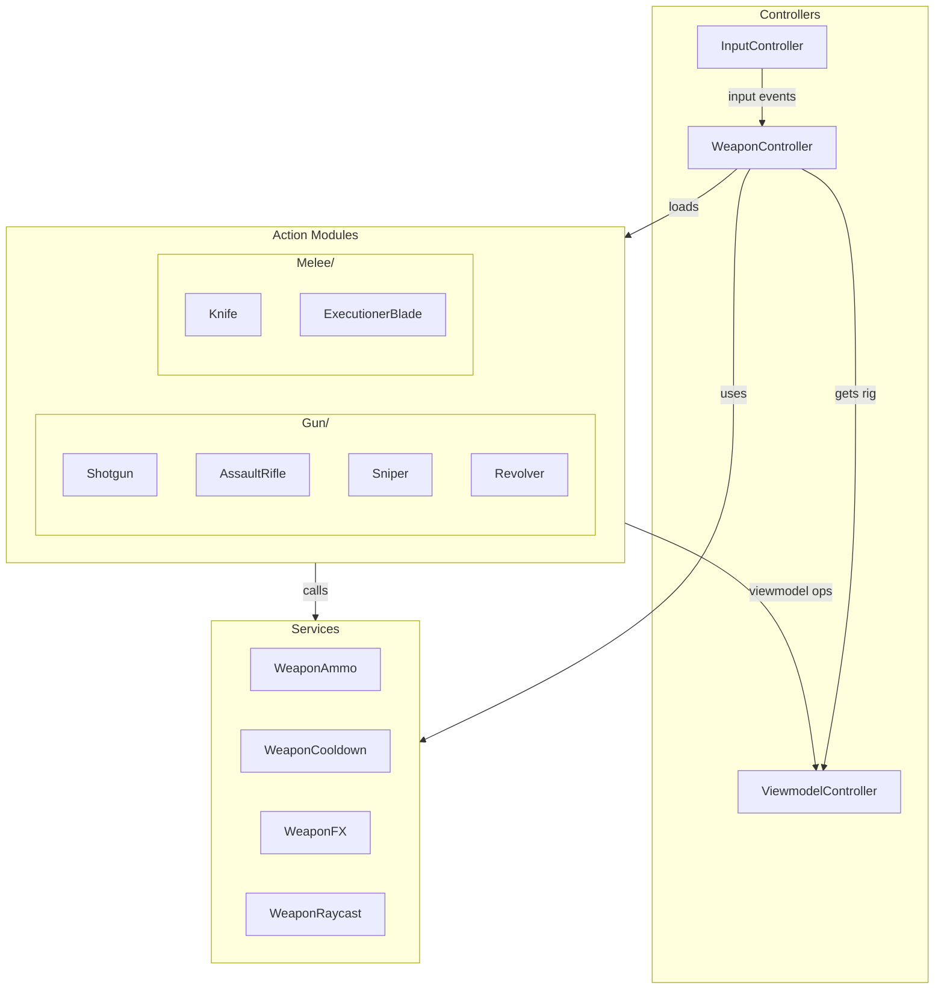

# Weapon Controller System

The WeaponController is a client-side controller that handles weapon input, action delegation, and state management. All weapon-specific logic is delegated to modular Action modules.

## Architecture Overview



## File Structure

```
StarterPlayer/StarterPlayerScripts/Initializer/Controllers/Weapon/
├── WeaponController.lua          # Main controller
└── Services/
    ├── WeaponAmmo.lua            # Ammo management
    ├── WeaponCooldown.lua        # Cooldown tracking
    ├── WeaponFX.lua              # Visual effects
    └── WeaponRaycast.lua         # Raycast utilities

ReplicatedStorage/Game/Weapons/Actions/
├── Gun/
│   ├── Shotgun/
│   │   ├── init.lua              # Main module
│   │   ├── Attack.lua
│   │   ├── Reload.lua
│   │   ├── Inspect.lua
│   │   └── Special.lua           # ADS
│   ├── AssaultRifle/
│   ├── Sniper/
│   └── Revolver/
└── Melee/
    ├── Knife/
    └── ExecutionerBlade/
```

---

## WeaponController API

### Lifecycle Methods

#### `Init(registry, net)`
Initializes the controller with the registry and networking layer.

```lua
function WeaponController:Init(registry, net)
```

| Parameter | Type | Description |
|-----------|------|-------------|
| `registry` | `Registry` | Controller registry for accessing other controllers |
| `net` | `Net` | Networking module for server communication |

#### `Start()`
Starts the controller, connects to input events, and begins listening for slot changes.

```lua
function WeaponController:Start()
```

#### `Destroy()`
Cleans up connections, stops auto-fire, and unequips the current weapon.

```lua
function WeaponController:Destroy()
```

---

### Action Methods

#### `Reload()`
Triggers the reload action for the currently equipped weapon.

```lua
function WeaponController:Reload()
```

- Checks cancel logic (`ReloadCancelsSpecial`)
- Delegates to the weapon's `Reload.Execute()` module

#### `Inspect()`
Triggers the inspect action for the currently equipped weapon.

```lua
function WeaponController:Inspect()
```

- Delegates to the weapon's `Inspect.Execute()` module
- Applies viewmodel offset and plays animation

#### `Special(isPressed)`
Triggers the special action (ADS for guns, ability for melee).

```lua
function WeaponController:Special(isPressed: boolean)
```

| Parameter | Type | Description |
|-----------|------|-------------|
| `isPressed` | `boolean` | `true` on press, `false` on release |

- For guns: Handles ADS (Aim Down Sights)
- For melee: Handles special abilities
- Checks cancel logic (`SpecialCancelsReload`)

---

### Getter Methods

#### `GetAmmoService()`
Returns the WeaponAmmo service instance.

```lua
function WeaponController:GetAmmoService(): WeaponAmmo
```

#### `GetCooldownService()`
Returns the WeaponCooldown service instance.

```lua
function WeaponController:GetCooldownService(): WeaponCooldown
```

#### `GetCurrentActions()`
Returns the currently loaded action modules for the equipped weapon.

```lua
function WeaponController:GetCurrentActions(): ActionModules?
```

**Returns:**
```lua
{
    Main = Module,      -- init.lua module
    Attack = Module,    -- Attack.lua module
    Reload = Module,    -- Reload.lua module
    Inspect = Module,   -- Inspect.lua module
    Special = Module,   -- Special.lua module
}
```

#### `GetWeaponInstance()`
Returns the current weapon instance object.

```lua
function WeaponController:GetWeaponInstance(): WeaponInstance?
```

---

## WeaponCooldown Service API

The WeaponCooldown service manages named cooldowns for weapon actions.

### Constructor

#### `new()`
Creates a new WeaponCooldown instance.

```lua
local cooldown = WeaponCooldown.new()
```

---

### Methods

#### `StartCooldown(name, duration)`
Starts a named cooldown.

```lua
function WeaponCooldown:StartCooldown(name: string, duration: number)
```

| Parameter | Type | Description |
|-----------|------|-------------|
| `name` | `string` | Unique identifier for the cooldown |
| `duration` | `number` | Duration in seconds |

**Example:**
```lua
cooldown:StartCooldown("KnifeSpecial", 3.0)
```

#### `IsOnCooldown(name)`
Checks if a cooldown is currently active.

```lua
function WeaponCooldown:IsOnCooldown(name: string): boolean
```

#### `GetRemainingTime(name)`
Gets the remaining time in seconds.

```lua
function WeaponCooldown:GetRemainingTime(name: string): number
```

#### `GetProgress(name)`
Gets the cooldown progress as a value from 0 to 1 (for UI).

```lua
function WeaponCooldown:GetProgress(name: string): number
```

- Returns `0` at start of cooldown
- Returns `1` when cooldown is complete

#### `ClearCooldown(name)`
Force clears a cooldown.

```lua
function WeaponCooldown:ClearCooldown(name: string)
```

#### `ClearAllCooldowns()`
Clears all active cooldowns.

```lua
function WeaponCooldown:ClearAllCooldowns()
```

---

### Signals

#### `OnCooldownChanged()`
Returns a signal that fires when a cooldown starts.

```lua
function WeaponCooldown:OnCooldownChanged(): Signal
```

**Callback signature:** `(name: string, duration: number, progress: number)`

#### `OnCooldownComplete()`
Returns a signal that fires when a cooldown completes.

```lua
function WeaponCooldown:OnCooldownComplete(): Signal
```

**Callback signature:** `(name: string)`

**Example:**
```lua
local cooldown = weaponController:GetCooldownService()
cooldown:OnCooldownComplete():Connect(function(name)
    print("Cooldown complete:", name)
end)
```

---

## WeaponInstance Object

The WeaponInstance is the object passed to all action module functions. It provides access to weapon state, services, and helper functions.

### Core References

| Property | Type | Description |
|----------|------|-------------|
| `Player` | `Player` | The local player |
| `WeaponId` | `string` | Weapon identifier (e.g., "Shotgun") |
| `WeaponName` | `string` | Same as WeaponId |
| `WeaponType` | `string` | "Gun" or "Melee" |
| `Config` | `table` | Weapon configuration from LoadoutConfig |
| `Slot` | `string` | Current slot ("Primary", "Secondary", "Melee") |
| `Net` | `Net` | Networking module for server communication |

### Services

| Property | Type | Description |
|----------|------|-------------|
| `Ammo` | `WeaponAmmo` | Ammo management service |
| `Cooldown` | `WeaponCooldown` | Cooldown tracking service |
| `FX` | `WeaponFX` | Visual effects service |

### Functions

#### `GetViewmodelController()`
Returns the ViewmodelController instance.

```lua
local vmc = weaponInstance.GetViewmodelController()
```

#### `GetRig()`
Returns the active viewmodel rig.

```lua
local rig = weaponInstance.GetRig()
-- rig.Model is the viewmodel model
```

#### `PlayAnimation(name, fade, restart)`
Plays a viewmodel animation.

```lua
weaponInstance.PlayAnimation("Fire", 0.05, true)
```

| Parameter | Type | Description |
|-----------|------|-------------|
| `name` | `string` | Animation name |
| `fade` | `number` | Fade time in seconds |
| `restart` | `boolean` | Whether to restart if already playing |

#### `PlayWeaponTrack(name, fade)`
Plays a weapon animation track and returns the track.

```lua
local track = weaponInstance.PlayWeaponTrack("Inspect", 0.1)
if track then
    track.Stopped:Once(function()
        -- Animation finished
    end)
end
```

#### `PerformRaycast(ignoreSpread)`
Performs a raycast from the camera.

```lua
local hitData = weaponInstance.PerformRaycast(false)
```

**Returns:**
```lua
{
    origin = Vector3,
    direction = Vector3,
    hitPart = BasePart?,
    hitPosition = Vector3,
    hitPlayer = Player?,
    hitCharacter = Model?,
    isHeadshot = boolean,
}
```

#### `GeneratePelletDirections(profile)`
Generates spread directions for shotgun-style weapons.

```lua
local directions = weaponInstance.GeneratePelletDirections({
    pelletsPerShot = 8,
    spread = 0.15,
})
```

#### `PlayFireEffects(hitData)`
Plays fire effects (muzzle flash, sounds, etc.).

```lua
weaponInstance.PlayFireEffects(hitData)
```

#### `RenderTracer(hitData)`
Renders a bullet tracer.

```lua
weaponInstance.RenderTracer(hitData)
```

### State Management Functions

#### `GetIsReloading()`
Returns whether the weapon is currently reloading.

```lua
local isReloading = weaponInstance.GetIsReloading()
```

#### `SetIsReloading(value)`
Sets the reloading state.

```lua
weaponInstance.SetIsReloading(true)
```

#### `GetReloadToken()`
Returns the current reload token (used to cancel reloads).

```lua
local token = weaponInstance.GetReloadToken()
```

#### `IncrementReloadToken()`
Increments and returns the new reload token.

```lua
local newToken = weaponInstance.IncrementReloadToken()
```

### State Object

The `State` property contains the current weapon state:

```lua
weaponInstance.State = {
    CurrentAmmo = number,    -- Ammo in magazine
    ReserveAmmo = number,    -- Reserve ammo
    IsReloading = boolean,   -- Currently reloading
    IsAttacking = boolean,   -- Currently firing
    LastFireTime = number,   -- os.clock() of last fire
    Equipped = boolean,      -- Weapon is equipped and visible
}
```

---

## Action Module Interface

Each weapon must have an action folder with the following modules:

### init.lua (Main Module)

The main module defines lifecycle hooks and cancel behavior.

```lua
local Weapon = {}

-- Cancel behavior configuration (required)
Weapon.Cancels = {
    FireCancelsSpecial = false,    -- Does firing exit special (ADS)?
    SpecialCancelsFire = false,    -- Does special block firing?
    ReloadCancelsSpecial = true,   -- Does reload exit special?
    SpecialCancelsReload = true,   -- Does special cancel reload?
}

-- Called once when weapon actions are first loaded
function Weapon.Initialize(weaponInstance)
end

-- Called when weapon becomes active (switched to)
function Weapon.OnEquip(weaponInstance)
    if weaponInstance.PlayAnimation then
        weaponInstance.PlayAnimation("Equip", 0.1, true)
    end
end

-- Called when switching away from this weapon
function Weapon.OnUnequip(weaponInstance)
    local Special = require(script:WaitForChild("Special"))
    if Special.IsActive() then
        Special.Cancel()
    end
end

-- Optional: Check if weapon can fire
function Weapon.CanFire(weaponInstance): boolean
    return (weaponInstance.State.CurrentAmmo or 0) > 0
end

-- Optional: Check if weapon can reload
function Weapon.CanReload(weaponInstance): boolean
    return (weaponInstance.State.ReserveAmmo or 0) > 0
end

-- Optional: Check if weapon can use special
function Weapon.CanSpecial(weaponInstance): boolean
    return not weaponInstance.State.IsReloading
end

return Weapon
```

---

### Attack.lua

Handles the attack/fire action.

```lua
local Attack = {}

function Attack.Execute(weaponInstance, currentTime): (boolean, string?)
    -- Validate state
    if not weaponInstance or not weaponInstance.State then
        return false, "InvalidInstance"
    end
    
    local state = weaponInstance.State
    
    if state.IsReloading then
        return false, "Reloading"
    end
    
    if (state.CurrentAmmo or 0) <= 0 then
        return false, "NoAmmo"
    end
    
    -- Fire rate check
    local config = weaponInstance.Config
    local fireInterval = 60 / (config.fireRate or 600)
    if state.LastFireTime and currentTime - state.LastFireTime < fireInterval then
        return false, "Cooldown"
    end
    
    -- Update state
    state.LastFireTime = currentTime
    state.CurrentAmmo = state.CurrentAmmo - 1
    
    -- Play animation
    weaponInstance.PlayAnimation("Fire", 0.05, true)
    
    -- Perform raycast and send to server
    local hitData = weaponInstance.PerformRaycast(false)
    if hitData and weaponInstance.Net then
        weaponInstance.Net:FireServer("WeaponFired", {
            weaponId = weaponInstance.WeaponName,
            timestamp = currentTime,
            origin = hitData.origin,
            direction = hitData.direction,
            hitPosition = hitData.hitPosition,
            -- ... other hit data
        })
    end
    
    return true
end

return Attack
```

**Return values:**
- `true` - Attack succeeded
- `false, "InvalidInstance"` - WeaponInstance is invalid
- `false, "NotEquipped"` - Weapon not equipped
- `false, "Reloading"` - Currently reloading
- `false, "NoAmmo"` - No ammo in magazine
- `false, "Cooldown"` - Fire rate cooldown active

---

### Reload.lua

Handles the reload action.

```lua
local Reload = {}

function Reload.Execute(weaponInstance): (boolean, string?)
    if not weaponInstance or not weaponInstance.State then
        return false, "InvalidInstance"
    end
    
    local state = weaponInstance.State
    local config = weaponInstance.Config
    
    -- Already reloading
    if weaponInstance.GetIsReloading() then
        return false, "Reloading"
    end
    
    -- Already full
    if (state.CurrentAmmo or 0) >= (config.clipSize or 0) then
        return false, "Full"
    end
    
    -- No reserve ammo
    if (state.ReserveAmmo or 0) <= 0 then
        return false, "NoReserve"
    end
    
    -- Start reload
    weaponInstance.SetIsReloading(true)
    local reloadToken = weaponInstance.IncrementReloadToken()
    
    weaponInstance.PlayAnimation("Reload", 0.1, true)
    
    -- Complete reload after duration
    task.delay(config.reloadTime or 2.0, function()
        if not weaponInstance.GetIsReloading() then
            return
        end
        if weaponInstance.GetReloadToken() ~= reloadToken then
            return
        end
        
        -- Transfer ammo
        local needed = config.clipSize - state.CurrentAmmo
        local toReload = math.min(needed, state.ReserveAmmo)
        state.CurrentAmmo = state.CurrentAmmo + toReload
        state.ReserveAmmo = state.ReserveAmmo - toReload
        
        weaponInstance.SetIsReloading(false)
    end)
    
    return true
end

-- Optional: Interrupt reload (for shell-by-shell weapons)
function Reload.Interrupt(weaponInstance): (boolean, string?)
    if not weaponInstance.GetIsReloading() then
        return false, "NotReloading"
    end
    
    weaponInstance.SetIsReloading(false)
    weaponInstance.IncrementReloadToken()
    
    return true
end

-- Optional: Cancel reload (called by WeaponController)
function Reload.Cancel()
    -- Token-based cancellation handles this
end

return Reload
```

---

### Inspect.lua

Handles the weapon inspection action.

```lua
local ReplicatedStorage = game:GetService("ReplicatedStorage")
local Locations = require(ReplicatedStorage.Shared.Util.Locations)
local ServiceRegistry = require(Locations.Shared.Util.ServiceRegistry)

local Inspect = {}
Inspect._isInspecting = false

function Inspect.Execute(weaponInstance): (boolean, string?)
    if not weaponInstance or not weaponInstance.State then
        return false, "InvalidInstance"
    end
    
    local state = weaponInstance.State
    if state.IsReloading or state.IsAttacking then
        return false, "Busy"
    end
    
    local viewmodelController = ServiceRegistry:GetController("Viewmodel")
    if not viewmodelController then
        return false, "NoViewmodel"
    end
    
    Inspect._isInspecting = true
    
    -- Set inspect offset (smoothly transitions via spring)
    local resetOffset = viewmodelController:SetOffset(
        CFrame.new(0.15, -0.05, -0.2) * CFrame.Angles(math.rad(15), math.rad(-20), 0)
    )
    
    -- Play inspect animation
    local track = viewmodelController:PlayWeaponTrack("Inspect", 0.1)
    
    local function onComplete()
        Inspect._isInspecting = false
        if resetOffset then
            resetOffset()
        end
    end
    
    if track then
        track.Stopped:Once(onComplete)
    else
        task.delay(2, onComplete)
    end
    
    return true
end

function Inspect.Cancel()
    if not Inspect._isInspecting then
        return
    end
    
    Inspect._isInspecting = false
    
    local viewmodelController = ServiceRegistry:GetController("Viewmodel")
    if viewmodelController then
        viewmodelController:SetOffset(CFrame.new())
        
        local animator = viewmodelController._animator
        if animator and type(animator.Stop) == "function" then
            animator:Stop("Inspect", 0.1)
        end
    end
end

function Inspect.IsInspecting(): boolean
    return Inspect._isInspecting
end

return Inspect
```

---

### Special.lua

Handles the special action (ADS for guns, abilities for melee).

#### Gun Special (ADS Example)

```lua
local ReplicatedStorage = game:GetService("ReplicatedStorage")
local Locations = require(ReplicatedStorage.Shared.Util.Locations)
local ServiceRegistry = require(Locations.Shared.Util.ServiceRegistry)

local Special = {}
Special._isADS = false
Special._resetOffset = nil
Special._originalFOV = nil

function Special.Execute(weaponInstance, isPressed): (boolean, string?)
    if not weaponInstance then
        return false, "InvalidInstance"
    end
    
    -- Hold behavior (isPressed = true means ADS, false means hip)
    Special._isADS = isPressed
    
    if Special._isADS then
        Special:_enterADS(weaponInstance)
    else
        Special:_exitADS(weaponInstance)
    end
    
    return true
end

function Special:_enterADS(weaponInstance)
    local viewmodelController = ServiceRegistry:GetController("Viewmodel")
    if not viewmodelController then
        return
    end
    
    local rig = viewmodelController:GetActiveRig()
    if not rig or not rig.Model then
        return
    end
    
    -- Find aim attachment: rig.Model -> Primary -> Aim
    local gunContent = rig.Model:FindFirstChild("Primary", true)
    local adsAttachment = gunContent and gunContent:FindFirstChild("Aim")
    
    if adsAttachment then
        -- Calculate offset to align aim attachment with camera center
        local adsOffset = rig.Model:GetPivot():ToObjectSpace(adsAttachment.WorldCFrame):Inverse()
        Special._resetOffset = viewmodelController:SetOffset(adsOffset)
    end
    
    -- Reduce FOV
    local config = weaponInstance.Config
    if config.adsFOV then
        Special._originalFOV = workspace.CurrentCamera.FieldOfView
        workspace.CurrentCamera.FieldOfView = config.adsFOV
    end
    
    -- Play ADS animation
    if weaponInstance.PlayWeaponTrack then
        weaponInstance.PlayWeaponTrack("ADS", 0.15)
    end
end

function Special:_exitADS(weaponInstance)
    -- Reset viewmodel offset
    if Special._resetOffset then
        Special._resetOffset()
        Special._resetOffset = nil
    end
    
    -- Reset FOV
    if Special._originalFOV then
        workspace.CurrentCamera.FieldOfView = Special._originalFOV
        Special._originalFOV = nil
    end
    
    -- Play hip animation
    if weaponInstance and weaponInstance.PlayWeaponTrack then
        weaponInstance.PlayWeaponTrack("Hip", 0.15)
    end
end

function Special.Cancel()
    if not Special._isADS then
        return
    end
    
    Special._isADS = false
    Special:_exitADS(nil)
end

function Special.IsActive(): boolean
    return Special._isADS
end

return Special
```

#### Melee Special (Ability Example)

```lua
local Special = {}
Special._isActive = false

function Special.Execute(weaponInstance, isPressed): (boolean, string?)
    if not weaponInstance then
        return false, "InvalidInstance"
    end
    
    -- Only trigger on press
    if not isPressed then
        return true
    end
    
    local cooldownService = weaponInstance.Cooldown
    
    -- Check cooldown
    if cooldownService and cooldownService:IsOnCooldown("KnifeSpecial") then
        return false, "Cooldown"
    end
    
    Special._isActive = true
    
    -- Play special animation
    weaponInstance.PlayAnimation("Special", 0.05, true)
    
    -- Start cooldown
    local config = weaponInstance.Config
    local specialCooldown = config.specialCooldown or 3.0
    if cooldownService then
        cooldownService:StartCooldown("KnifeSpecial", specialCooldown)
    end
    
    -- Perform attack
    local hitData = weaponInstance.PerformRaycast(true)
    if hitData and weaponInstance.Net then
        weaponInstance.Net:FireServer("MeleeSpecial", {
            weaponId = weaponInstance.WeaponName,
            timestamp = os.clock(),
            hitPosition = hitData.hitPosition,
            -- ... other data
        })
    end
    
    -- Reset active state
    task.delay(0.3, function()
        Special._isActive = false
    end)
    
    return true
end

function Special.Cancel()
    Special._isActive = false
end

function Special.IsActive(): boolean
    return Special._isActive
end

return Special
```

---

## Cancel Logic System

The `Cancels` table in the main module (init.lua) controls how actions interact:

```lua
Cancels = {
    FireCancelsSpecial = false,    -- Does firing exit special (ADS)?
    SpecialCancelsFire = false,    -- Does special block firing?
    ReloadCancelsSpecial = true,   -- Does reload exit special?
    SpecialCancelsReload = true,   -- Does special cancel reload?
}
```

### Examples

**Standard Gun (fire while ADS):**
```lua
Cancels = {
    FireCancelsSpecial = false,    -- Can fire while in ADS
    SpecialCancelsFire = false,    -- ADS doesn't block firing
    ReloadCancelsSpecial = true,   -- Reload exits ADS
    SpecialCancelsReload = true,   -- Can't reload while in ADS
}
```

**Heavy Melee (special blocks attacks):**
```lua
Cancels = {
    FireCancelsSpecial = true,     -- Attack cancels special windup
    SpecialCancelsFire = true,     -- Special blocks normal attacks
    ReloadCancelsSpecial = false,  -- N/A for melee
    SpecialCancelsReload = false,  -- N/A for melee
}
```

---

## Input Bindings

| Action | PC | Controller |
|--------|-----|------------|
| Fire | Left Mouse (MB1) | R2 / RT |
| Special (ADS/Ability) | Right Mouse (MB2) | L2 / LT |
| Reload | R | - |
| Inspect | F | - |

---

## Adding a New Weapon

### Step 1: Add to LoadoutConfig

Add the weapon configuration to `ReplicatedStorage/Configs/LoadoutConfig.lua`:

```lua
MyNewGun = {
    id = "MyNewGun",
    name = "My New Gun",
    description = "A cool new weapon.",
    imageId = "rbxassetid://...",
    weaponType = "Primary",  -- or "Secondary", "Melee"
    rarity = "Rare",
    
    -- Ammo (for guns)
    maxAmmo = 90,
    clipSize = 30,
    reloadTime = 2.0,
    
    -- ADS (for guns)
    adsFOV = 50,
    adsSpeedMultiplier = 0.7,
    
    -- Fire profile (for guns)
    fireProfile = {
        mode = "Auto",  -- "Auto", "Semi", "Shotgun"
        autoReloadOnEmpty = true,
    },
    
    -- Stats
    damage = 25,
    fireRate = 600,
    range = 300,
    
    -- Cooldowns (for melee)
    attackCooldown = 0.5,
    specialCooldown = 5.0,
},
```

### Step 2: Create Action Folder

Create the action modules at `ReplicatedStorage/Game/Weapons/Actions/Gun/MyNewGun/` (or `Melee/`):

```
MyNewGun/
├── init.lua       # Main module with Cancels, OnEquip, OnUnequip
├── Attack.lua     # Attack logic
├── Reload.lua     # Reload logic (guns only)
├── Inspect.lua    # Inspect logic
└── Special.lua    # ADS (guns) or ability (melee)
```

### Step 3: Create Viewmodel

Create the viewmodel rig at `ReplicatedStorage/Game/Viewmodel/Gun/MyNewGun_Default/` with:
- Arms model
- Weapon model with "Primary" part containing "Aim" attachment (for ADS)
- AnimationController with animations: Idle, Fire, Reload, Inspect, ADS, Hip, Equip

### Step 4: Test

1. Add the weapon to a loadout
2. Equip via slot switching
3. Test all actions: Fire, Reload, Inspect, Special
4. Verify cancel logic works correctly

---

## Debugging

Enable debug logging by setting in WeaponController.lua:
```lua
local DEBUG_WEAPON = true
```

Common issues:
- **Action folder not found**: Ensure folder name matches weapon ID exactly
- **Animation not playing**: Check AnimationController has the track
- **ADS not working**: Verify "Aim" attachment exists on weapon model
- **Cooldown not working**: Ensure cooldown service is used with correct name
